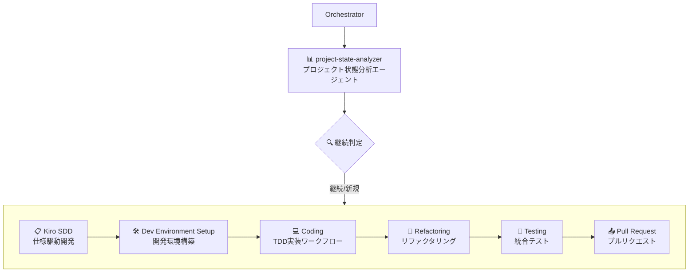
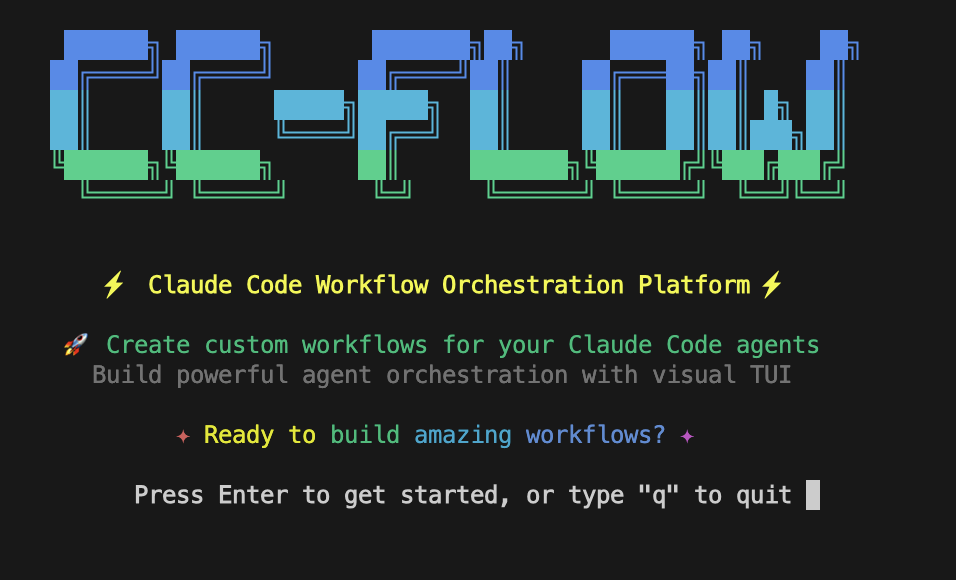
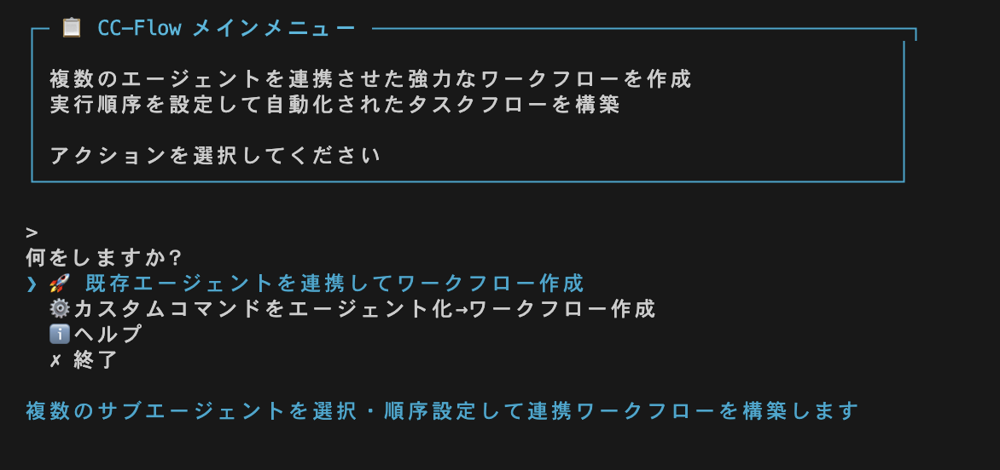
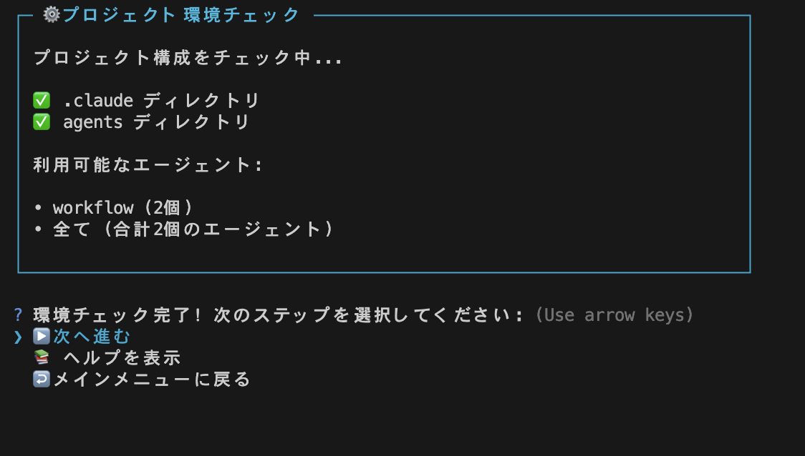
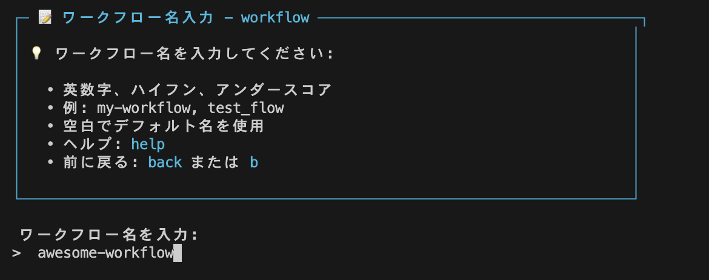
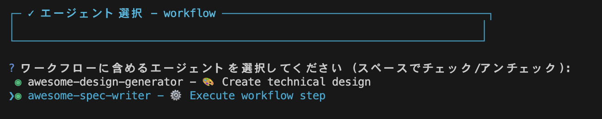
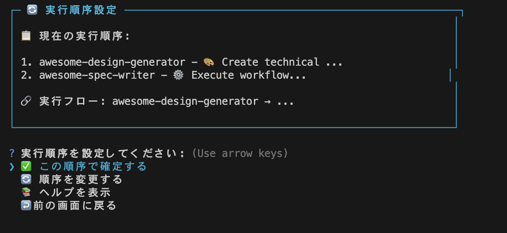
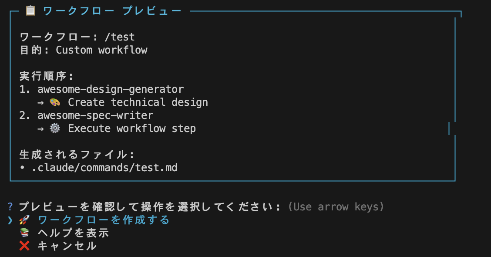
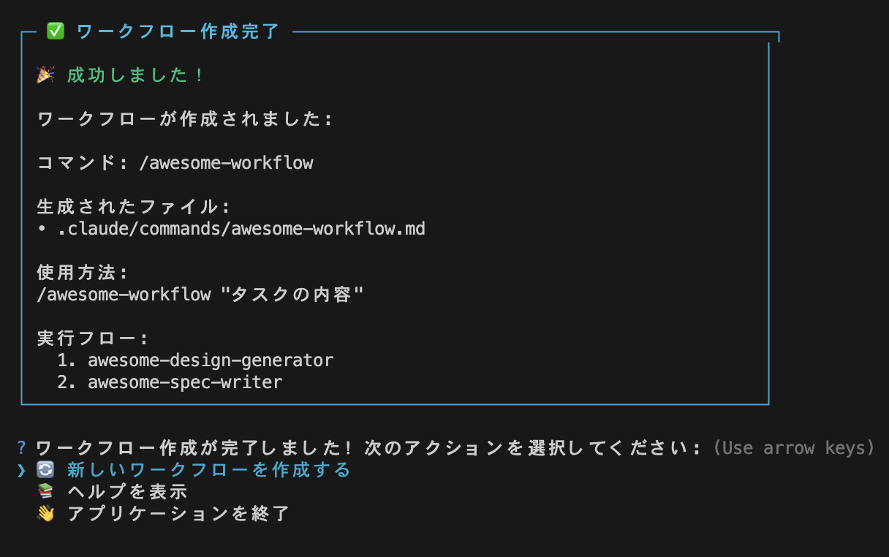
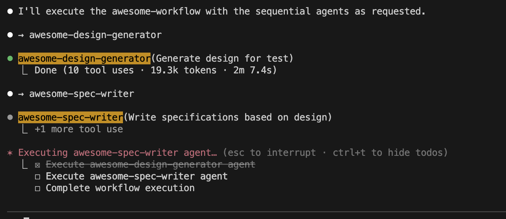

# Claude Code でサブエージェントを順次実行するワークフローを作成するツール「CC-Flow」の紹介

## はじめに

最近、Claude Code を使って「設計 → 実装 → テスト → PR」という流れを丸ごと自動化できないかと考え、検証用のプラットフォームを作っていました。

このプラットフォームは **YAML ファイル**で**サブエージェント**を制御し、ワークフローを実行する仕組みです。



ただ実際にやってみると、**サブエージェントを順番に実行していくことは意外と面倒** だと気づきました。

そこで「もっとシンプルにワークフローを定義できる仕組みが欲しい」と思い、「**CC-Flow**」 を作りました。この記事では、その仕組みと使い方を紹介します。

https://github.com/s-hiraoku/cc-flow

## なぜ作ろうと思ったか

Claude Code でワークフローを組む際、サブエージェントを順に呼び出していけば簡単に実現できると考え、この方法を採用しました。
しかし実際に使ってみると、次のような課題がありました。

- YAML ファイルが膨大になり、管理が大変
- 呼び出し順を変えるだけでも修正が煩雑
- 作ったフローを再利用しづらい
- AIがYAML制御を理解せず、サブエージェントに直接指示を書くため、毎回確認と修正作業が発生する

小規模なフローなら問題になりませんが、「設計 → 実装 → テスト → PR」のような大規模フローでは致命的な手間になります。

そこで、同じことを繰り返している中で違うのは「**タスクの目的**」と「**呼び出すサブエージェント**」だけだと気づき、ここを仕組み化すればもっと楽にフローが作れると考えました。

そこで発想したのが、サブエージェントを順番に実行してワークフローを作成するツール、「**CC-Flow**」です。

### 応用例

[spec-kit](https://github.com/github/spec-kit) や [cc-sdd](https://github.com/gotalab/cc-sdd) などのカスタムスラッシュコマンドを順次実行して仕様書を自動生成する際、手動でコマンドを呼び出す代わりに、このツールで作成したフローで最後まで自動実行できます。ユーザーとの対話機能は維持されます。

## 使い方

使い方は簡単です。.claudeにワークフローで使用するスラッシュコマンドやサブエージェントを用意します。

```sh
.claude/
├── agents/
│   └── workflows/       # ワークフロー用サブエージェント
│       ├── awesome-spec-writer.md
│       └── awesome-design-generator.md
└── commands/
    └── workflows/       # ワークフロー用スラッシュコマンド
        ├── awesome-requirements.md
        └── awesome-diagram-maker.md
```

このツールはディレクトリ単位でサブエージェントを選択する仕組みなので、上記のようなディレクトリ構造が便利です。

そして起動して画面の指示に従って実行すると、ワークフローを作成できます。

ツールを起動します。

```sh
npx @hiraoku/cc-flow-cli
```



メインメニューで作成方法を選択します。

作成方法は２種類あります。

**既存のサブエージェントを連携してワークフローを作成する方法**と、**スラッシュコマンドをサブエージェントに変換してからワークフローを作成する方法**です。



スラッシュコマンドからワークフローを作成する際は、まずエージェントへの変換処理が必要ですが、実際に使っていただければフローは理解できるため、今回はサブエージェントからワークフローを作成する方法で説明します。

作成方法は以下です。

1. 「既存エージェントを連携してワークフローを作成」を選択します。
2. 「プロジェクト環境チェック」画面に遷移します。この時サブエージェントがなければ、エラーになりますので、作成してください。
   
3. 「次へ進む」を選択します。
   
4. ワークフロー名を入力してください。これがスラッシュコマンドのファイル名となります。
   
5. 実行する順序を決めます。変更する場合は、「順序を変更する」を選んで変更してください。
   
6. プレビューが表示されるので、よければ「ワークフローを作成する」を選択してください。
   
7. 作成に成功すると、以下の画面が表示され、commandsディレクトリにワークフローが作成されます。
   
8. あとはClaude Code で作成したスラッシュコマンドを実行すると、指定した順番通りにサブエージェントが実行されます。
   

説明しやすいように簡単な構成で、ワークフローを作成しました。順番で実行したいスラッシュコマンドなどがあった場合、このワークフローツールを使うと、1つのスラッシュコマンドになるので、実行が楽になります。

## CC-Flow の仕組み

CC-FlowはClaude Codeのスラッシュコマンドとエージェント機能を活用して、カスタムワークフローを作成するシステムです。
これにより、シンプルでありながらサブエージェントの特性と利点を最大限に活かしたワークフロー作成が可能になります。

### スクリプトとテンプレートを使用したシステム

CC-Flowの基本設計は、スクリプトとテンプレートを使用してワークフローを構築します。それぞれ`scripts`フォルダと`templates`に保存しています。中身を見るとわかりますが、とてもシンプルな構造になっています。

```sh: scriptフォルダ
scripts/
├── create-workflow.sh      # メインエントリー
├── lib/
│   ├── agent-discovery.sh  # エージェント検索・表示
│   ├── template-processor.sh # テンプレート処理・ファイル生成
│   └── user-interaction.sh # 対話的プロンプト・入力検証
```

ワークフローテンプレートは変数置換によってカスタムスラッシュコマンドを生成します。

### POMLを使用したプロンプトの生成

CC-Flowの最大の特徴は、プロンプト生成に[POML](https://microsoft.github.io/poml/latest/)を使用しています。
POMLを使うことによって、プログラマブルに汎用的なプロンプトの生成が可能です。

### 画面

画面は現状おまけです。もともとはスクリプトベースで動作していましたが、利便性を高めるために画面をつけました。せっかくなのでReact Inkを使って改善していこうと考えています。

### カスタマイズ性

システム全体がシンプルな構造になっているため、用途に応じたカスタマイズが容易です。

テンプレート: Markdownファイルで簡単に編集可能
エージェント: .claude/agents/ディレクトリに追加するだけ
スクリプト: シェルスクリプトで処理ロジックを拡張可能

ぜひ皆さまで用途に応じたカスタマイズをしてください。

## まとめ

現状ではサブエージェントの順次呼び出しにしか対応していませんが、今後はClaude Code本来の振る舞いのように、任意のサブエージェントを呼び出せるように対応する予定です。
これにより、例えば実装フェーズではTDDサブエージェント、コーディングサブエージェント、リファクタリングサブエージェントなどを用意し、適材適所で呼び出すことが可能となり、より高品質なアプリケーションを作成できるようになります。

まだ開発段階なので、また新たな機能も追加していきますので、stay tunedしてください。

現状ではCodexが話題でかなりの勢いですねっ。Codexもサブエージェント機能が搭載されることを期待しています。
